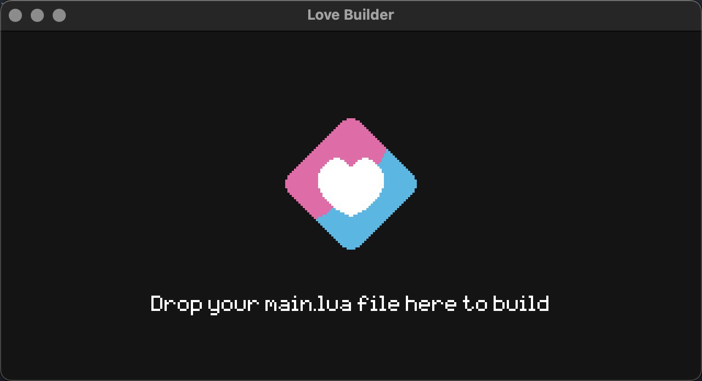

# löve-build
An app (built in LÖVE!) for quickly packaging LÖVE games for distribution, based off the most recent comments in [this issue](https://github.com/love2d/love/issues/890).

The goal is to make something eventually maintained by the LÖVE team that can let new developers build their games cross-platform from their own machine in a single step - with zero dependencies and no need for VMs.

*This app will build + export your game for LÖVE (.love), Windows (.exe), MacOS (.app), and Linux (.zip) - regardless of the platform you're developing on!*




---


## Usage
First you will need to setup a `build.lua` file in the root of your project:
```lua
return {
  
  -- basic settings:
  name = 'SuperGame', -- name of the game for your executable
  developer = 'CoolDev', -- dev name used in metadata of the file
  output = 'dist', -- output location for your game, defaults to $SAVE_DIRECTORY
  version = '1.1a', -- 'version' of your game, used to name the folder in output
  love = '11.5', -- version of LÖVE to use, must match github releases
  ignore = {'dist', 'ignoreme.txt'}, -- folders/files to ignore in your project
  icon = 'resources/icon.png', -- 256x256px PNG icon for game, will be converted for you
  
  -- optional settings:
  use32bit = false, -- set true to build windows 32-bit as well as 64-bit
  identifier = 'com.love.supergame', -- macos team identifier, defaults to game.developer.name
  libs = { -- files to place in output directly rather than fuse
    windows = {'resources/plugin.dll'}, -- can specify per platform or "all"
    all = {'resources/license.txt'}
  },
  hooks = { -- hooks to run commands via os.execute before or after building
    before_build = 'resources/preprocess.sh',
    after_build = 'resources/postprocess.sh'
  },
  platforms = {'windows'} -- set if you only want to build for a specific platform
  
}
```

Then download the build application for your OS from the [releases](https://github.com/ellraiser/love-build/releases) page.

To use the app directly, simply run it. You will see a screen prompting you to drag your `main.lua` file into the app - doing so will start the build process and export your game, opening the export location when finished. A `build.log` file will also be created to view any errors (see [Troubleshooting](#troubleshooting) for common issues).

You can view the `example-project` in this repository for an example setup/config.

> Note: First time builds will be slower due to downloading and caching LÖVE source files - after that it'll be much faster!


---


## Command Line
If you want to run via CLI, the application accepts an argument which is the full path to your `main.lua` file:

Windows => `build.exe FULL/PATH/TO/main.lua`  
MacOS => `build/Contents/MacOS/love FULL/PATH/TO/main.lua`  
Linux => `build.AppImage FULL/PATH/TO/main.lua`

You can also pass a second option to specify the target platforms you want - by default all platforms are specified (`windows,macos,linux`), but if you want to only build for one specific platform you can do so like:  
`build.exe FULL/PATH/TO/main.lua windows`


---


## Cross-Platform Building
Regardless of the platform you run the builder from it will export your game to all 3 platforms.  
These will each be put in their own `.zip` file inside the `output/version` folder specified by your `build.lua`.

| Build From  | Windows | MacOS | Linux |
| ----------- | ------- | ----- | ----- |
| Windows     |    ✓    |   ✓   |   ✓^  |
| MacOS       |    ✓    |   ✓   |   ✓^  |
| Linux       |    ✓    |   ✓   |   ✓^  |

^ Linux builds are currently a 'basic' export, not an AppImage - chmod+run the `AppRun` file to run

> Note: MacOS builds are _not_ signed so are not suitable for AppStore distribution


---


## Troubleshooting
These are the common errors you might see when building.  
You can view the logs inside `output/version/build.log` after running the builder.

| Error                                                           | Info                                                       |
| --------------------------------------------------------------- | ---------------------------------------------------------- |
| Failed to mount project path                                    | The project path isn't readable by the executable
| Failed to mount output path                                     | The output path isn't read/writeable by the executable
| No build.lua file in project root                               | The path given doesn't have a build.lua
| Invalid build.lua file in project root                          | The build.lua in the project doesn't return a valid table
| No main.lua file in project root                                | The path you provided doesn't have a main.lua
| Path must be to your game\'s "main.lua" file                    | The path given doesn't lead to a main.lua file
| Failed to create .lovefile                                      | Failed to create lovefile, check logs for info
| Source download failed                                          | Failed to download release from github
| Source file must be supplied to build this version              | Specificed version doesn't have a release on github
| Fatal Error!                                                    | Something triggered love.errorhandler - check build.log

> Note: If you want to build with 12.0 you'll need to provide the source zips yourself in the `%appdata%/love-build/cache` directory, you can download the builds from the [latest successful workflow action](https://github.com/love2d/love/actions), as the main branch on Github is on version 12. I would recommend building with 11.5 first to see the expected files in your cache.


---


## Todo
**.AppImages for Linux export**  
Currently the `love-squashfs` lib handles decompressing squashfs binaries fine, however resquashing them has an issue I'm working on. At the moment the Linux export just uses the same AppImage directory format with a `AppRun` entrypoint and fused binary, which will work fine for most distros so no harm there (it also works a bit better for Steam distribution, just set your installation path as the `AppRun` file)
 
Once I fix up the `love-squashfs` compression issue lovebuild could add a proper `.AppImage` if needed, but I think we should still keep the `-linux.zip` output as an option for people who want it, similar to the additional 32bit option windows has.

See [todo.md](todo.md) for stuff planned in future or ideas for contributions.
